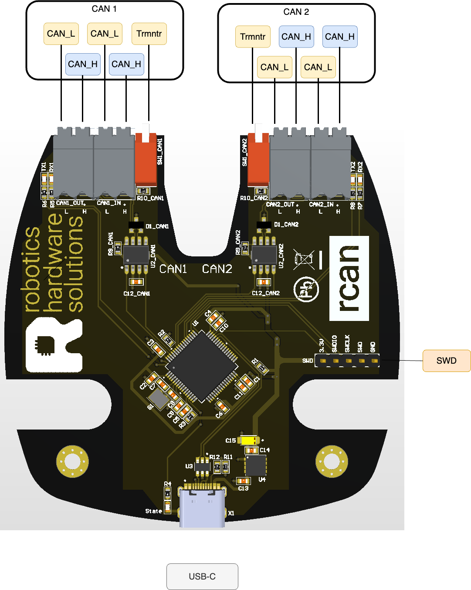
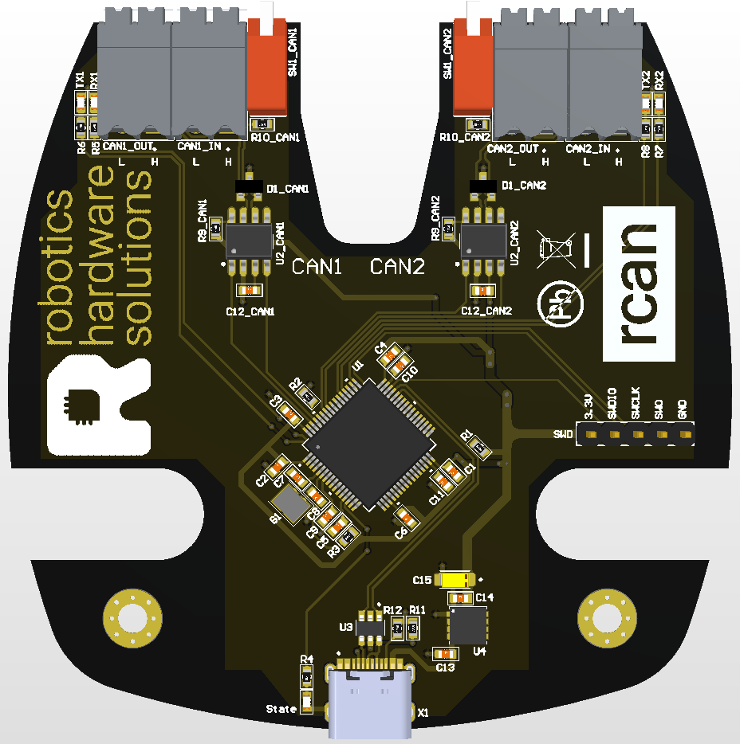
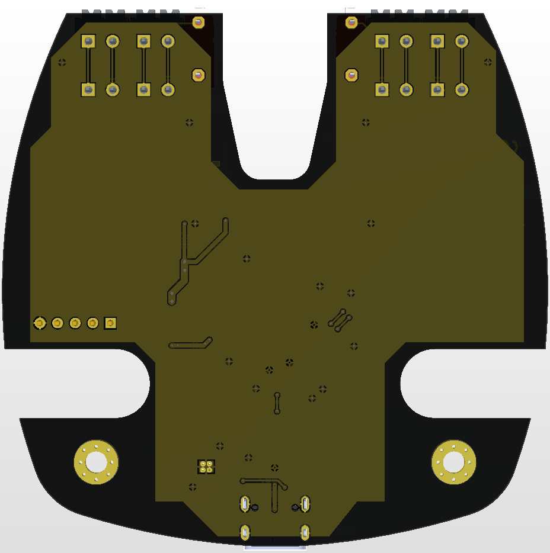

# rcan-usb-hardware 

## Documentation:
[all documentation files](doc/pcb/) 
[schematic](<doc/pcb/Schematic Prints.PDF>) 
[assembly drawings](<doc/pcb/Assembly Drawings.PDF>) 
[board options](doc/pcb/board_options.txt)

## Pinout and pcb image
 
 

